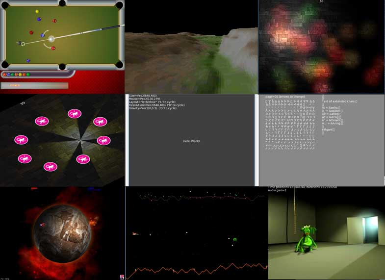
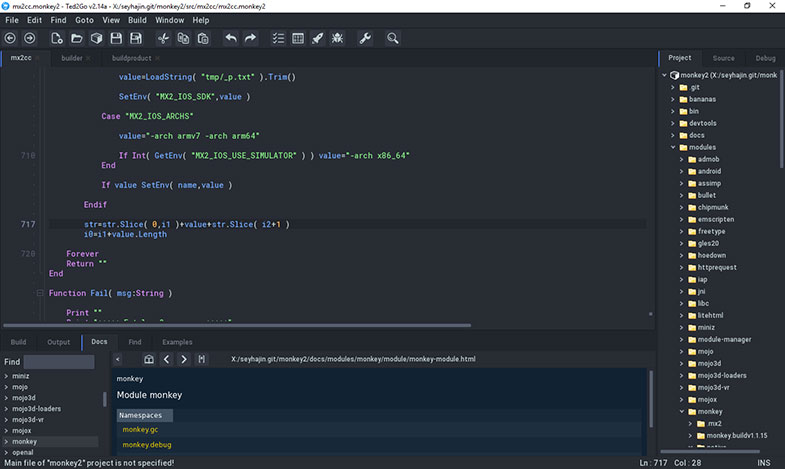

# Welcome to Monkey2!

**Monkey2** is a new programming language designed by Mark Sibly, creator of the ‘Blitz’ range of languages.

### Showcase



### Ted2Go (IDE)



------

While staying true to the ‘basic’ style of the original blitz languages, Monkey2 offers some very powerful new features including:

### Generic classes and methods 

Classes, interfaces, structs, methods and functions can have 'type' parameters.

```monkey
Struct Rect<T>
	Field x0:T, y0:T
	Field x1:T, y1:T
End

'Main entry
Function Main()
	Local r:=New Rect<Float>
End
```

### 'First class' functions :

Functions (and methods) can be stored in variables and passed to/from other functions.

```monkey
Function Test1()
	Print "Test1"
End

Function Test2()
	Print "Test2"
End

Function Tester( test:Void() )
	test()
End

'Main entry
Function Main()
	Tester( Test1 )
	Tester( Test2 )
End
```

### Lambda functions

Lambda functions allow you to create closures.

```monkey
Function Test( func:Void() )
	func()
End

'Main entry
Function Main()
	For Local i:=0 Until 10
		Test( Lambda()
			Print i
		End)
	Next
End
```

### New 'Struct' type that provides value semantics

Structs are similar to classes in that they encapsulate member data, but differ in that they are passed around 'by value' instead of 'by reference'.

This allows structs to be efficiently create on the stack without any garbage collection overhead.

```monkey
Struct S
	Field data:Int=10
End

Function Test( s:S )
	s.data = 100
End

'Main entry
Function Main()
	Local s:=New S 'Create a new S on the stack (very fast!)
	Test( s )      'Test gets a copy of 's'
	Print s.data   'Print '10'
End
```

### Fibers for easy asynchronous programming

Fibers provide support for 'cooperative' multi-threading.

```monkey
Function Server( host:String, service:String )
	Local server:=Socket.Listen( host, service )
	
	Repeat
		Local client:=server.Accept()
		New Fiber( Lambda()
			Local data:=client.Receive(...)
		End )
	Forever
End
```

### Operator overloading

Operator overloading allows you to override the meaning of the built-in language operators, making for more expressive code.

```monkey
Struct Vec2
	Field x:Float
	Field y:Float

	Method New( x:float,y:Float )
		Self.x=x
		Self.y=y
	End

	Operator+:Vec2( v:Vec2 )
		Return New Vec2( x+v.x,y+v.y )
	End

	Operator To:String()
		Return "Vec2("+x+","+y+")"
	End
End

'Main entry
Function Main()
	Local v0:=New Vec2( 10,20 )
	Local v1:=New Vec2( 30,40 )
   
	Print v0+v1
End
```
### Class extensions

Class extensions allow you to add extra methods, functions and properties to existing classes.

```monkey
Struct Foo
	Field i:Int=0
End 
```
```monkey
Struct Foo Extension
	Method Increment()
		i+=1
	End
End
```

### Fully garbage collected

Monkey2 provides a ‘mostly’ incremental garbage collector that efficiently collects garbage as it runs without any of those annoying ‘sweep’ spikes found in typical garbage collectors.

### Optional reflection features

Monkey2 includes an optional reflection system that allows you to inspect and modify variables and values at runtime:

```monkey
#Import "<reflection>"

Class C
	Method Update( msg:String )
		Print "C.Update : msg=" + msg
	End
End

'Main entry
Function Main()
	Local c:=New C
	
	Local type:=Typeof( c )
	Print type
	
	Local decl:=type.GetDecl( "Update" )
	decl.Invoke( c, "Hello World!" )
End

```

### Multi-target products

Monkey2 works on a wide range of targets: Windows, Macos, Linux, Emscripten, Android and iOS.

#### Desktop targets

| Windows | MacOS | Linux | Raspbian |
| ------- | ----- | ----- | -------- |
|  |  |  |  |

#### Mobile targets

| Android      | iOS             |
| ------------ | --------------- |
|  |  |

#### Web targets

| Emscripten                                                   |
| --------------------------------------------------------- |
|  |

### More information

##### Monkey2

 Development blog : http://monkeycoder.co.nz/

 Discord channel : https://discord.gg/ZHpRAFp

 Itch.io page: https://blitzresearch.itch.io/monkey2

 Github page: https://github.com/blitz-research/monkey2

##### Ted2Go

 Github page: https://github.com/engor/Ted2Go


------


## How to build 'monkey2' from source

If you are reading this on github, please note there are prebuilt versions of monkey2 (with complete source code) available from https://blitzresearch.itch.io/monkey2.

### Building 'monkey2' on Windows

Unless you are using one of the prebuilt releases, you will need to install the mingw-64 compiler. There is a self-extracting archive of mingw-64 that has been tested with monkey2 here: http://monkeycoder.co.nz/get-file?file=i686-6.2.0-posix-dwarf-rt_v5-rev1.exe.

If you install this to the monkey2 'devtools' directory, the following steps should 'just work' (ha!) :

1. Open a command prompt and change to the 'monkey2\scripts' directory.
2. Enter `rebuildall.bat` and hit return. Wait...
3. If all went well, you should end up with a 'Monkey2 (Windows)' exe in the monkey2 directory. Run this to launch the Ted2go IDE.
4. You should now be able to build and run monkey2 apps. There are some sample apps in the monkey2/bananas directory.

### Building 'monkey2' on MacOS/Linux

* On **MacOS**, install the XCode command line tools. You can do this by entering in a shell :

```shell
xcode-select --install
```

* On **Linux**, install the GCC toolchain and libraries. You can do this by entering in a shell :

```shell
sudo apt-get install g++-multilib libopenal-dev libpulse-dev libsdl2-dev`
```
1. Open a shell and change to the 'monkey2/scripts' directory.
2. Enter `./rebuildall.sh` and hit return. Wait...
3. If all went well, you should end up with a 'Monkey2 (...)' app in the monkey2 directory. Run this to launch the Ted2go IDE.
4. You should now be able to build and run monkey2 apps. There are some sample apps in the monkey2/bananas directory.

