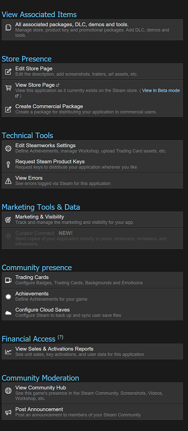

# Steamworks

Steamworks module for monkey2.

## Brief

Add steam achievements, leaderboards and friends to your game with steamworks module by nitrologic.

## Introduction

The Steamworks SDK from Valve Corporation provides many great features that can enhance your game when you choose to publish on Steam.

Not only does Steam grant access to the largest community of PC gamers on the planet, it provides a selection of services for saving games, rewarding players with achievements and hosting leaderboards.

Monkey2 developers can also choose to publish for free by joining the monkeylabs banana publisher program. Friend simonarmstrong (me) on Steam when you have a list of stats, achievements and leaderboard requirements of your banana.



Publishing your own game on Steam has never been simpler. A per title $US100 fee paid to Valve Coporation replaced the community based greenlight system.

## In Progress

 * Stats
 * Leaderboards
 * Achievements

## Future

* Matchmaking
* Steam Inventory Service
* Anti-cheat technology
* In-game economy with microtransactions
* Management of user-generated content
* Per-User cloud storage

# BASICS

The source code to the following is from the mods/steamworks/bananas folder.

## SteamAPI initialise and shutdown

Step one is to add calls to SteamAPI_Init and SteamAPI_Shutdown to the programs Main() function.

```monkey
#Import "<steamworks>"

Using steamworks..

Function Main()
	Local haveSteam := SteamAPI_Init()
   
	If Not haveSteam
		Print "SteamAPI_Init failed, is steam running and steam_appid.txt file attached?"
		Return
	Endif
	
	Print "SteamAPI_Init returned "+haveSteam
	
	Local loggedOn := SteamUser().BLoggedOn()
	
	Print "SteamUser()->BLoggedOn() returned "+loggedOn

	SteamAPI_Shutdown()
End
```

This program (steamworks/bananas/test1.monkey2) should fail SteamAPI_Init() and exit cleanly.

Step two is to run the bat file windows_copy_appid.bat. Importing appid.

The appids located in the bananas folder include valve_spacewar(440) and mojolabs_bananas(768030).

### Note! 

Until further notice the steam_appid.txt file must be copied into the products Windows folder **after** the first build.

Run the bat file windows_copy_appid.bat which invokes the following file copies:

```bat
rem after building test1 run this script to add the steam_appid placeholder

copy steam_appid.txt test1.products\Windows
copy steam_appid.txt test2.products\Windows
copy steam_appid.txt test3.products\Windows

```

## Stats, Achievements and Leaderboards

The next example (steamworks/bananas/test2.monkey2) illustrates communicating with the steam service.

The Marshal object is a work in progress method for handling steam events.

Both an event queue and lambda based callback support is planned.

### Stats

### Leaderboards

The example leaderboard **Lucky Number Game** and the achievement NEW_ACHIEVEMENT_1_0 are available when running as a mojolabs_bananas application.

Use the 

### 

* F1 - help
* F2 - download leaderboard scores
* F3 - play magic number
* F4 - award achievement
* F5 - clear achievement
* F6 - list friends
* F7 - sync state
* F10 - show friends with steam overlay

### Notes

# References

1. Valve Steamworks SDK [Readme.txt](Readme.txt)
2. steamworks reference documentation https://partner.steamgames.com/doc/home
3. monkey2 on steam [monkey2](http://store.steampowered.com/app/768030/monkey2/?beta=1) 
